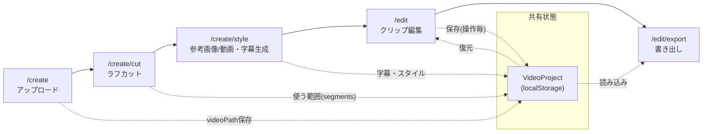
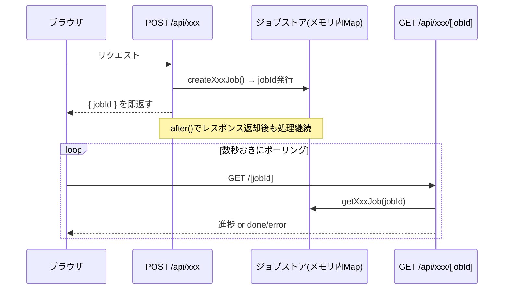

# アーキテクチャ

前提として [README.md](../README.md) の「使い方」「ディレクトリ構成」を読んでいること。
ここでは画面をまたいだ**データの流れ**と、複数機能で繰り返し使われる**共通パターン**を扱う。

## 技術スタック

- **Next.js 16**(App Router, Route Handlers) + React 19 + TypeScript(strict) + Tailwind CSS v4
- **Remotion 4** — 動画の宣言的な合成・プレビュー(`@remotion/player`)・ヘッドレスレンダリング
  (`@remotion/renderer` + `@remotion/bundler`)
- **Gemini API**(`@google/genai`) — 文字起こし・参考画像/動画からのスタイル抽出・AI音声合成(TTS)
- **zod** — API入力検証、および Remotion の入力プロパティスキーマ(`StandardVideoProps`)
- パスエイリアス(`tsconfig.json`): `@/*` → `src/*`、`@video/*` → `remotion/*`
- 状態永続化は **DBなし**。ブラウザの `localStorage` のみ(単一ユーザー・単一ブラウザ前提)

## 画面遷移とデータの流れ

- `/create`〜`/create/style` は **その場のReact state** で編集を積み上げ、`/edit` へ渡す直前に
  一度だけ `videoProject.ts` の `saveProject()` で `localStorage` に書き込む。
- `/edit` に入ってからは **操作のたびに** `saveProject()` が呼ばれる(自動保存)。リロード/
  再訪問時は `loadProject()` で復元する。
- `/edit/export` は `loadProject()` で読み込むだけで、`/edit` 側の未保存React stateとは独立
  (自動保存されている前提)。

## 共有状態: `VideoProject`

[src/lib/videoProject.ts](../src/lib/videoProject.ts) が唯一の永続化された編集状態。

- `segments: ProjectSegment[]` — クリップ本体(トリム範囲・字幕・演出・音量)。**配列の順序が
  そのまま再生順**であり、元動画上の時間順とは独立(並べ替え機能で崩れるため、絶対に
  ソートし直してはいけない、とコード内コメントに明記されている)。
- `sfx: ProjectSfxClip[]` / `bgm: ProjectBgm | null` — 効果音・BGM設定。
- スタイル系フィールド(`captionStyle` / `fontFamily` / `captionPosition` / `fontSize` /
  `primaryColor` / `fadeInOut`)。
- `normalizeProject()` が、保存データに後から追加されたフィールド(`fontSize` / `fadeInOut` /
  `sfx` / `bgm` / `segment.volume` 等)が無い**古い保存データ**を補完する。**新しい編集項目を
  追加する時は、ここへのデフォルト値追加を忘れると古いプロジェクトの復元時に壊れる。**

### `VideoProject` → Remotion 入力プロパティへの変換

`VideoProject`(編集用の内部状態)と、Remotionが実際に描画に使う `StandardVideoProps`
([remotion/templates/standard/schema.ts](../remotion/templates/standard/schema.ts))は**別の型**。
`buildStandardVideoProps()` がその変換を担う唯一の場所で、プレビュー(`/edit` のRemotion
Player)と書き出し(`/edit/export` → `/api/render`)の**両方から同じ関数を呼ぶ**ことで表示と
書き出し結果の食い違いを防いでいる。用語の対応は [glossary.md](./glossary.md) を参照。

## 非同期ジョブ + ポーリングのパターン

Gemini呼び出しやヘッドレスレンダリングなど、数十秒〜数分かかりうる処理は共通して
「ジョブ化してポーリング」する設計になっている。対象:

- `POST /api/transcribe-captions` (字幕生成)
- `POST /api/extract-style` / `POST /api/extract-style-from-video` (スタイル抽出。同じジョブ
  ストアを共有)
- `POST /api/render` (動画書き出し)

- ジョブストアの実体は各機能ごとに独立した**プロセス内メモリの `Map`**
  (`transcribeJobs.ts` / `extractStyleJobs.ts` / `renderJobs.ts`)。**単一Node.jsプロセス前提**
  であり、サーバー再起動やマルチインスタンス化をするとジョブが消える/見つからなくなる。
  完了後は一定時間(TTL)でエントリを自動削除する。
- 例外は `POST /api/generate-voiceover`(テロップ1件分のAI音声合成)。処理が数秒で終わるため
  ジョブ化せず**同期レスポンス**で返す。新しい機能を足す際、処理時間が長くなりそうなら
  この3つと同じジョブパターンに倣う。

## ファイル配信の注意点

アップロードされた動画・音声、生成された音声/レンダリング結果は、いずれもビルド成果物
ではなくランタイムで増える実ファイルであり、`public/videos` `public/audio` `public/renders`
に保存される。

- **通常の Next.js `public/` 配信はビルド時点のスナップショットしか返さない**ため、本番ビルド
  後(`next build` → `next start`)に追加されたファイルは 404 になる。これを避けるため
  `src/app/api/media/[...path]/route.ts` がリクエストの都度ファイルシステムから読んで配信する
  (HTTP Range対応。iOSの「ビデオを保存」やシーク動作に必要)。
- **`@remotion/bundler` の `bundle()` も同様に一度だけ `public/` をコピーしたスナップショットを
  配信する**ため、レンダー時(`/api/render`)はアップロード済みファイルのパスを
  `http://127.0.0.1:{PORT}/api/media/...` の絶対URLに差し替えてヘッドレスChromeに渡している
  (`resolveUploadedSrc()` in `src/app/api/render/route.ts`)。**新しいメディア種別(例:
  スタンプ画像アップロード等)を追加する時、この差し替えを忘れるとレンダー結果にだけ
  反映されない不具合になる。**

## その他の制約

- **メモリ内ジョブストア前提**のため水平スケール不可(README「デプロイ」章の Render.com
  Freeプラン運用が前提)。
- `next.config.ts` で `serverExternalPackages: ["@remotion/bundler", "@remotion/renderer"]` を
  指定し、`output: "standalone"` を使わない構成にしている(ネイティブバイナリの動的requireが
  standalone のファイルトレースで解決できずランタイムENOENTになるため)。デプロイ構成を
  変える際は README の「デプロイ」章を必ず参照する。
