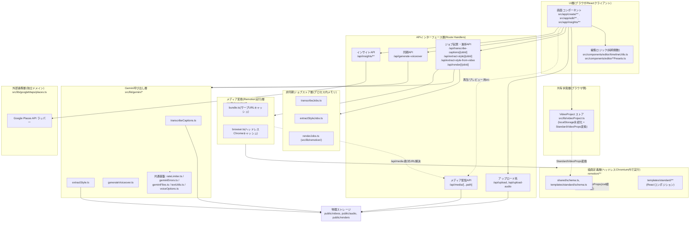
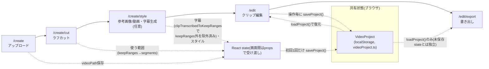

# アーキテクチャ設計書(S2)

作成: メインセッション(`fullstack-developer`ペルソナを注入。一部観点のみ`microservices-architect`の
「Domain Analysis」を限定利用。詳細は[00-agent-plan.md](./00-agent-plan.md) §2, §4参照)
対象コミット: `d489138`(ブランチ `prototype/1`)
前提: [01-requirements.md](./01-requirements.md) の確定方針・壊してはいけない機能一覧をすべて満たすこと。

## 1. 設計方針の要約

- **モノリシックなNext.jsアプリを維持する。** DBなし、Render.com Freeプラン(単一プロセス・
  512MBメモリ)前提、`localStorage`による状態永続化、インメモリ`Map`によるジョブストアは
  いずれも変更しない。マイクロサービス化・DB導入・認証導入は行わない。
- **物理的なファイル移動・リネームは提案しない。** 既存の`src/lib`配下(`gemini/`
  `remotion/` `googleMaps/` `videoProject.ts` `uploadedVideo.ts`)、`src/app/api/**/route.ts`、
  `src/components/editor/**`、`remotion/**`のディレクトリ構成は妥当に機能しており、
  変更コストに見合わない。本設計は**既存配置を論理レイヤーとして言語化し直す**ことが
  目的であり、実装(S3以降)へのファイル移動指示は含まない。
- **将来の拡張性は「言語化」にとどめる。** 「将来分割したくなった場合にどこが継ぎ目か」を
  明示するが、今回の実装差分(S3, S4)で分割やインターフェース抽象化を先取りして行うことは
  しない(YAGNI。動作に影響しない範囲、という確定方針を優先する)。
- **既存動作を壊さない。** 01-requirements.md §4「壊してはいけない機能一覧」に影響する
  変更は本設計には含まれない(§6で確認する)。

## 2. モジュール構成図(論理レイヤー)

物理ディレクトリは変えず、以下の6層として意味付けする。矢印は依存の向き(上位層が
下位層を呼ぶ。逆方向の依存は無い)。

補足:

- **UI層と共有状態層(`VideoProject`)は同じ「ブラウザ側」に属するが、意図的に分離している。**
  `videoProject.ts`は`"use client"`かつDOM/`localStorage`にしか依存しない純粋な永続化・変換
  ロジックであり、画面コンポーネント(`ClipEditor.tsx`等)から独立して差し替え可能な境界として
  扱える(例: 将来`localStorage`以外の永続化に差し替える場合の置換単位)。
- **APIインターフェース層は「HTTPの受け口」に徹し、実処理は下位層に委譲する構造がすでに
  徹底されている。** 例: `src/app/api/render/route.ts`はzod検証・ジョブ起票・`after()`での
  非同期実行制御のみを持ち、実際のレンダリング処理(`bundle()`, `openBrowser()`,
  `renderMedia()`)は`src/lib/remotion/*`に委譲している。この既存の分離は妥当なので維持する。
- **`uploadedVideo.ts`(`src/lib`直下)は上記6層のいずれにも属さない「APIインターフェース層内の
  検証ユーティリティ」** という位置づけが正確(パストラバーサル対策・MIME解決。現状通り
  `/api/media`等から使われる想定で、独立レイヤーとして格上げする必要はない)。
- **ジョブストア層が機能ごとに3つ独立している(`transcribeJobs.ts` / `extractStyleJobs.ts` /
  `renderJobs.ts`)のは意図的な設計として妥当。** 共通化(汎用`JobStore<T>`化)は技術的には
  可能だが、各ジョブの状態遷移(`TranscribeJobPhase` / `ExtractStyleJob` / `RenderJob`)が
  型として異なり、無理に共通化すると型安全性が下がる。**今回は共通化を提案しない**
  (動作への影響なしに実施できる改善ではあるが、01-requirements.mdのスコープ外である
  「大規模リライト」に近づくため見送る。S3で軽微なリファクタとして扱うかは実装計画側の判断)。

## 3. データフロー

既存[docs/architecture.md](../architecture.md)の記述を土台とし、要件定義(01-requirements.md)
で再確認した内容を反映して精緻化する。

### 3.1 画面遷移とVideoProjectへの反映(精緻化)

01-requirements.md §3で確認した通り、`/create`〜`/create/style`は画面間を**React propsで
その場のstateとして**受け渡し、`/edit`へ渡る直前に初めて`saveProject()`が呼ばれる
(既存architecture.mdの記述を踏襲。変更なし)。

**再確認して明記した点(既存architecture.mdに無かった精緻化)**:

- 「使う範囲」から「クリップ」への名称遷移は[glossary.md](../glossary.md)の通り
  `ProjectSegment`という同じ型を通しで使う。`/create/cut`で確定した`segments`が
  `/create/style`・`/edit`でもそのまま(内容は変わるが型は同じ)使われ続ける。
- カットで捨てた範囲の除外は`src/components/editor/timelineUtils.ts`の
  `clipTranscribedToKeepRanges()`が担う。`/create/style`(`StyleAndTranscribe.tsx`)が
  Gemini文字起こし結果(動画全体を対象に生成される)を受け取った直後にこの関数を通し、
  `/create/cut`で確定した`keepRanges`外の発話を切り詰めてから`segments`に反映する。
  **この処理はUI層(クライアント)で行われ、APIレイヤーやGemini呼び出し層は関知しない**
  ——Gemini側(`transcribeCaptions.ts`)は常に動画全体を文字起こしする。

### 3.2 共有状態: `VideoProject` → `StandardVideoProps`変換(既存記述を踏襲)

`buildStandardVideoProps()`(`src/lib/videoProject.ts`)が唯一の変換点であり、プレビュー
(`/edit`のRemotion Player)と書き出し(`/edit/export` → `/api/render`)の両方が同じ関数を
呼ぶ。既存architecture.mdの記述通りで変更なし。

### 3.3 非同期ジョブ+ポーリングパターン(既存記述を踏襲、対象APIを再確認)

対象: `POST /api/transcribe-captions`、`POST /api/extract-style`、
`POST /api/extract-style-from-video`(ジョブストアは`/api/extract-style`と共有)、
`POST /api/render`。シーケンスは既存architecture.mdの図の通りで変更なし。

**再確認して明記した点**:

- 例外は`POST /api/generate-voiceover`のみ(同期レスポンス)。ただし内部では
  最大3回のリトライ(`MAX_GENERATE_ATTEMPTS`、指数的バックオフ)を行っており、
  「同期だがレイテンシが数秒〜十数秒に伸びうる」点は01-requirements.md §4.3の
  リトライ要件(原因不明のエラーも含め全種類が対象)と整合している。
  `NoAudioDataError`(Gemini TTSが200 OKで空データを返す既知の不具合)も
  `isRetryableApiError`(429/503のHTTPエラー)と同列にリトライ対象へ含めている
  ([src/lib/gemini/generateVoiceover.ts](../../src/lib/gemini/generateVoiceover.ts))。
- Gemini呼び出し層全体(`transcribeCaptions.ts` / `extractStyle.ts` / `generateVoiceover.ts`)は
  `runWithGeminiRateLimit()`(`rateLimiter.ts`)を経由し、**プロセス全体で直列実行+
  最低呼び出し間隔(既定6.5秒、`GEMINI_MIN_INTERVAL_MS`で調整可)** を共有する。
  これは無料枠のRPM制限対策であり、3つの呼び出し元すべてが同じキューを共有する
  横断的関心事として明示しておく(将来Gemini呼び出しを追加する際は必ずこの関数を経由する)。

### 3.4 ファイル配信(既存記述を踏襲)

`public/videos` `public/audio` `public/renders`はビルド成果物ではなくランタイムで増える
実ファイルであり、`/api/media/[...path]`がリクエスト都度ファイルシステムから配信する
(HTTP Range対応)。`@remotion/bundler`の`bundle()`が配信する静的スナップショットには
含まれないため、`/api/render`側は`resolveUploadedSrc()`でアップロード済みメディアのパスを
`http://127.0.0.1:{PORT}/api/media/...`の絶対URLに差し替えてヘッドレスChromiumに渡す。
既存architecture.mdの記述通りで変更なし。新しいメディア種別を追加する際にこの差し替えを
忘れてはならない、という注意点も引き続き有効。

## 4. 将来マイクロサービス化する場合の分割候補

`microservices-architect`定義の「Domain Analysis」(Bounded context mapping / Service
boundary / Single responsibility focus / Domain-driven boundaries)の考え方のみを、
「今すぐ分割する提案」ではなく「継ぎ目の言語化」として限定利用する。K8s/Istio/Kafka等の
実装詳細は方針上扱わない。

| 分割候補 | なぜそこが継ぎ目として妥当か | 今分割しない理由 | 分割する場合に最初に必要になること |
|---|---|---|---|
| **Gemini呼び出し層**(`src/lib/gemini/*`) | 外部APIキー(`GEMINI_API_KEY`)・レート制限キュー・リトライロジックが他レイヤーと疎結合で、既に`transcribeCaptions()` / `extractStyle()` / `generateVoiceover()`という関数単位の明確なインターフェースを持つ。呼び出し元(Route Handlers)は結果の型だけに依存している。 | 呼び出し頻度・データ量ともに小さく、単一プロセス分離のオーバーヘッド(ネットワーク越しのFile API転送、レート制限キューの共有方法の再設計)に見合わない。Render Freeの制約下でプロセスを増やすとメモリ512MB上限に抵触しやすい。 | プロセス間で共有している`runWithGeminiRateLimit()`のキュー状態(現状インメモリの`Promise`チェーン)を外部化する手段(例: 共有ストアかリーダー選出)。 |
| **非同期ジョブ実行層**(3つのジョブストア + Remotion実行層) | 「ジョブを起票し、進捗をポーリングで返す」という同じ形のインターフェース(`createXxxJob` / `updateXxxJob` / `getXxxJob`)を持ち、UIやAPIインターフェース層から見ると差し替え可能な単位になっている。 | ジョブ状態がプロセス内メモリの`Map`であることが前提の設計全体(01-requirements.md §5「単一プロセス前提」)を崩すため、分割は即ちDB/外部ジョブキュー導入という大きな設計変更を伴う。今回のスコープ(DB導入なし)と正面から矛盾する。 | ジョブ状態を外部化する永続層(DBまたは外部キュー)と、TTLベース自動削除(`JOB_TTL_MS`)に代わる有効期限管理の再設計。 |
| **メディア変換(Remotion)実行層**(`src/lib/remotion/*` + `remotion/**`) | CPU/メモリを最も消費する処理(ヘッドレスChromium起動+フレーム描画)であり、他レイヤー(API層)からは`getServeUrl()` / `getBrowserInstance()`という2つの関数越しにしか使われていない。スケーリング要件が他機能と最も異なる(Render Freeで最初にメモリ/CPU律速になりやすい箇所)。 | ヘッドレスブラウザプロセスの起動コストが大きく、常駐前提のキャッシュ(`bundle.ts` / `browser.ts`)で初めて実用速度になっている。別プロセス/別サービスに切り出すと、この常駐キャッシュの前提(同一プロセス内`Promise`変数)から作り直しが必要になる。 | レンダーリクエストを受け渡すための同期的インターフェース(HTTP等)と、`/api/media`への到達性(現状はループバックHTTP前提)を跨プロセスでも保てる経路。 |
| **メディア配信層**(`/api/media/[...path]`) | 他の全レイヤーから見て「ファイルパスを渡すとバイト列が返る」という単純なインターフェースであり、既に`ALLOWED_DIRS`によるアクセス制御で境界が明確。CDN/オブジェクトストレージへの置き換えが最も想定しやすい箇所。 | 現状`public/videos` `public/audio` `public/renders`という同一ファイルシステム上の配置を前提に、アップロードAPIとレンダーAPIの両方が直接書き込んでいる。分割すると全書き込み元でアップロード先の変更が必要になり、変更範囲が全体に及ぶ。 | ファイル書き込み元(`upload` / `upload-audio` / `generate-voiceover` / `render`)を共通の「保存」インターフェース越しにする抽象化(現状は各route.tsが直接`fs`に書いている)。 |
| **インサイト機能**(`/insights`、`src/lib/googleMaps/places.ts`) | 01-requirements.md §2の通り動画編集機能とは**完全に独立**したドメイン(データの受け渡しも共有状態`VideoProject`も無い)。UI導線も非表示にされている。5つの候補の中で最も分割コストが低い(依存関係が無い)。 | 現状1機能・2 API・低トラフィックであり、単独プロセス化する利点(スケーリング・障害分離)が運用コスト(Render Free枠でのプロセス追加)に見合わない。 | `GOOGLE_MAPS_API_KEY`の環境変数分離(既に独立)以外は追加作業がほぼ無く、5候補の中で最も着手障壁が低い。 |

## 5. 既存`docs/architecture.md`との差分

| 項目 | 差分 |
|---|---|
| 技術スタック・画面遷移・共有状態(`VideoProject`)・`buildStandardVideoProps()`・非同期ジョブ+ポーリングパターン・ファイル配信の注意点 | **差分なし。既存の記述を踏襲する。** 実装済みコード([videoProject.ts](../../src/lib/videoProject.ts)、[render/route.ts](../../src/app/api/render/route.ts)、[media/[...path]/route.ts](../../src/app/api/media/%5B...path%5D/route.ts)等)を読み直して裏を取ったが、齟齬は無い。 |
| モジュール構成図(§2) | **新規追加。** 既存architecture.mdには論理レイヤー図が無かったため、本書§2で新たに言語化した。物理ディレクトリの変更は伴わない。 |
| `clipTranscribedToKeepRanges()`によるカット範囲の反映箇所(§3.1) | **精緻化。** 既存architecture.mdは「カットで捨てた範囲は字幕生成の対象外」とだけ記述していたが、実装(`timelineUtils.ts`)を確認し、UI層(クライアント)で`/create/style`遷移時に適用されることを明記した。Gemini呼び出し自体(`transcribeCaptions.ts`)は常に動画全体を対象にしている点も明記した。 |
| Geminiレート制限キュー(§3.3) | **精緻化。** 既存architecture.mdには`runWithGeminiRateLimit()`によるプロセス全体の直列実行・最低間隔の記載が無かったため追記した(直近コミット`8b3c3cc`での変更を反映)。 |
| 将来のマイクロサービス化に備えた分割候補(§4) | **新規追加。** 既存architecture.mdは現状構成の説明のみで、将来分割の観点は無かった。01-requirements.md §5「拡張性」の確定方針を受けて本書で新設した節。 |

`docs/architecture.md`自体の書き換えはS8(ドキュメント追従更新)の担当範囲であり、本書は
S2としての設計書に留める(00-agent-plan.md §7のハンドオフポイント通り)。

## 6. 「壊してはいけない機能一覧」への影響確認

01-requirements.md §4(4.1〜4.5)の各項目を本設計と突き合わせた結果、**影響する設計変更は
無い。**

- §2「モジュール構成図」は既存コードの論理的な意味付けのみで、ファイル配置・関数シグネチャ・
  API入出力を一切変更しない。
- §4「将来の分割候補」は言語化のみであり、今回の実装(S3, S4)でインターフェース抽出や
  ファイル分割を行うことを指示するものではない。
- §3「データフロー」は既存実装を読み直した結果の確認・精緻化であり、フロー自体の変更は
  提案していない。

したがって01-requirements.md §5の非機能要件(Render Free運用、単一プロセス前提、DBなし、
`output: "standalone"`不使用、アップロード上限、Safari互換フォールバック)もすべて維持される。

## 7. 参照した資料・コード

- `docs/design/00-agent-plan.md`、`docs/design/01-requirements.md`
- `docs/architecture.md`、`docs/api-reference.md`、`docs/glossary.md`
- `src/lib/videoProject.ts`、`src/lib/uploadedVideo.ts`
- `src/lib/gemini/transcribeJobs.ts`、`extractStyleJobs.ts`、`transcribeCaptions.ts`、
  `extractStyle.ts`(参照のみ、既読)、`generateVoiceover.ts`、`geminiErrors.ts`、
  `geminiFiles.ts`、`rateLimiter.ts`
- `src/lib/remotion/renderJobs.ts`、`bundle.ts`、`browser.ts`
- `src/lib/googleMaps/places.ts`
- `remotion/shared/schema.ts`、`remotion/templates/standard/schema.ts`
- `src/app/api/render/route.ts`、`src/app/api/media/[...path]/route.ts`
- `src/components/editor/timelineUtils.ts`(`clipTranscribedToKeepRanges`の定義箇所)
- `next.config.ts`(`serverExternalPackages`の確認)
